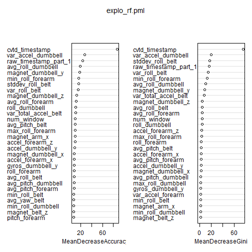
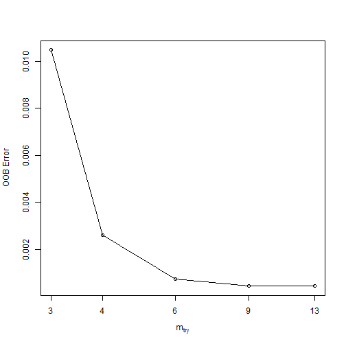

Building a Classification Algorithm to Evaluate Unilateral Dumbbell Biceps Curl Exercise Performance based on Human Activity Recognition Data
========================================================

# Introduction
According to the wikipedia encyclopedia[1], activity recognition aims to recognize the actions and goals of one or more agents from a series of observations on the agents actions and the environmental conditions. In Human Activity Recognition (HAR) the agents are human beings. Since the 1980s, this research field has captured the attention of several computer science communities due to its strength in providing personalized support for many different applications and its connection to many different fields of study such as medicine, human-computer interaction, or sociology.  According to the Human Activity Recognition (HAR) research  website (http://groupware.les.inf.puc-rio.br/har), HAR has emerged as a key research area and is gaining increasing attention by the pervasive computing research community. Using devices such as Jawbone Up, Nike FuelBand, and Fitbit it is now possible to collect a large amount of data about personal activity relatively inexpensively. Applications for HAR include elderly monitoring, life log systems for monitoring energy expenditure and for supporting weight-loss programs, and digital assistants for weight lifting exercises. This report considered data collected from weight lifting exercises.

# Aim
The aim of this project is to build a classification algorithm based on weight lifting data collected by the human activity recognition research (http://groupware.les.inf.puc-rio.br/har). The original data can be downloaded from http://groupware.les.inf.puc-rio.br/static/WLE/WearableComputing_weight_lifting_exercises_biceps_curl_variations.csv. Using data collected from accelerometers weared on the belt, forearm, arm, and dumbell, the algorithm must predict how well a set of Unilateral Dumbbell Biceps Curl exercise was performed by the wearer. The classification falls into five(5) classes depending on how well the wearer performed the set of Unilateral Dumbbell Biceps Curl. The different classes are as described in the data collection section that follows below.


# Data Collecting
According to Velloso et al [2],  the data was collected from six male participants aged between 20-28 years, with little weight lifting experience, and a using a relatively light dumbbell (1.25kg). The participants were asked to perform one set of 10 repetitions of the Unilateral Dumbbell Biceps Curl in in different fashions: exactly according to the specification (Class A), throwing the elbows to the front (Class B), lifting the dumbbell only halfway (Class C), lowering the dumbbell only halfway (Class D) and throwing the hips to the front (Class E). Class A corresponds to the specified execution of the exercise, while the other 4 classes correspond to common mistakes. Participants were supervised by an experienced weight lifter to make sure the execution complied to the manner they were supposed to simulate.


# Data Processing

## Data

The dataset used in building the classification algorithm was provided by the Human Activity research group (http://groupware.les.inf.puc-rio.br/har) and
Velloso, E. et al (2013) provides mored detailed description of the dataset. The data used for this report was downloaded from downloaded from https://d396qusza40orc.cloudfront.net/predmachlearn/pml-training.csv (*as per instructions in the project write-up page*). The algoritm was then tested using twenty(20) new test observations which were downloaded from https://d396qusza40orc.cloudfront.net/predmachlearn/pml-testing.csv.The followwing R code can be used to download and read the training and the 20 test cases datasets.


```r
# Download training csv file ; http URL instead of https URL
TrainingCSVFile <- "pml-training.csv"
if (!file.exists(TrainingCSVFile)) {
    fileUrl <- "http://d396qusza40orc.cloudfront.net/predmachlearn/pml-training.csv"
    download.file(fileUrl, destfile = TrainingCSVFile, method = "internal")
}

# Download test cases csv file; use http URL instead of https URL
TestingCSVFile <- "pml-testing.csv"
if (!file.exists(TestingCSVFile)) {
    fileUrl <- "http://d396qusza40orc.cloudfront.net/predmachlearn/pml-testing.csv"
    download.file(fileUrl, destfile = TestingCSVFile, method = "internal")
}

## stop if downloading failed or file 'pml-training.csv' not in working
## directory
if (!file.exists(TrainingCSVFile)) {
    # stop('Error: file :pml-training.csv is not in the working directory.')
}

## stop if downloading failed or file 'pml-testing.csv' not in working
## directory
if (!file.exists(TestingCSVFile)) {
    # stop('Error: file : pml-testing.csv is not in the working directory.')
}


## read training and test cases data from the files
trainData <- read.csv("pml-training.csv", header = TRUE)
testData <- read.csv("pml-testing.csv", header = TRUE)

dim(trainData)
```

```
## [1] 19622   160
```

```r
dim(testData)
```

```
## [1]  20 160
```


# Exploratory Analysis

## Features 
The training dataset contains 19622 observations and the testing dataset contains only 20. Each dataset contains  160  features/variables. APPENDIX A provdes a list of  all the feature names in the training dataset. Shown below are the first and last five(5) variable/features names.

```r
head(names(trainData), 5)
```

```
## [1] "X"                    "user_name"            "raw_timestamp_part_1"
## [4] "raw_timestamp_part_2" "cvtd_timestamp"
```

```r
tail(names(trainData), 5)
```

```
## [1] "accel_forearm_z"  "magnet_forearm_x" "magnet_forearm_y"
## [4] "magnet_forearm_z" "classe"
```


For the purposes building the classification algorithm, the class variable (*classe*) will be used as an outcome variable. The following R code shows the classification of the first ten(10) observations in the training dataset. The five levels of classification (A, B, C, D, E) are also shown

```r
head(trainData$classe, 10)
```

```
##  [1] A A A A A A A A A A
## Levels: A B C D E
```


## Data cleaning
Some of the feature names appear irrelevant for the required classifier and others contain errounous data and therefore need to the removed or cleaned. For example, the feature labelled **x** only contain sequence numbers for the observations and therefore provides not useful information for the algorithm.Some features,like **kurtosis_yaw_belt**, contain only null (empty) values or #DIV/0 error data and there can be removed from the datasets.  The R code below removes some of the features that do not contribute to the algorithm as noted above.


```r
## remove the first variable 'X' since its only sequence numbering of the
## observations; it's not a feature
trainData[["X"]] = NULL
testData[["X"]] = NULL

## the following variable were also removed because they contain blank data
## or #DIV/0! error data or contain only some zeros (0)
trainData[["kurtosis_yaw_belt"]] = NULL
testData[["kurtosis_yaw_belt"]] = NULL


trainData[["skewness_yaw_belt"]] = NULL
testData[["skewness_yaw_belt"]] = NULL


trainData[["amplitude_yaw_belt"]] = NULL
testData[["amplitude_yaw_belt"]] = NULL

trainData[["kurtosis_yaw_forearm"]] = NULL
testData[["kurtosis_yaw_forearm"]] = NULL

trainData[["skewness_yaw_forearm"]] = NULL
testData[["skewness_yaw_forearm"]] = NULL

trainData[["amplitude_yaw_forearm"]] = NULL
testData[["amplitude_yaw_forearm"]] = NULL

trainData[["kurtosis_yaw_dumbbell"]] = NULL
testData[["kurtosis_yaw_dumbbell"]] = NULL


trainData[["skewness_yaw_dumbbell"]] = NULL
testData[["skewness_yaw_dumbbell"]] = NULL

trainData[["amplitude_yaw_dumbbell"]] = NULL
testData[["amplitude_yaw_dumbbell"]] = NULL


## The following variables were also removed because they contains more than
## 97% null values
trainData[["kurtosis_roll_belt"]] = NULL
testData[["kurtosis_roll_belt"]] = NULL

trainData[["kurtosis_picth_belt"]] = NULL
testData[["kurtosis_picth_belt"]] = NULL

trainData[["skewness_roll_belt"]] = NULL
testData[["skewness_roll_belt"]] = NULL

trainData[["skewness_roll_belt.1"]] = NULL
testData[["skewness_roll_belt.1"]] = NULL


trainData[["max_yaw_belt"]] = NULL
testData[["max_yaw_belt"]] = NULL

trainData[["min_yaw_belt"]] = NULL
testData[["min_yaw_belt"]] = NULL


trainData[["kurtosis_roll_arm"]] = NULL
testData[["kurtosis_roll_arm"]] = NULL


trainData[["kurtosis_picth_arm"]] = NULL
testData[["kurtosis_picth_arm"]] = NULL

trainData[["kurtosis_yaw_arm"]] = NULL
testData[["kurtosis_yaw_arm"]] = NULL


trainData[["kurtosis_roll_forearm"]] = NULL
testData[["kurtosis_roll_forearm"]] = NULL


trainData[["kurtosis_picth_forearm"]] = NULL
testData[["kurtosis_picth_forearm"]] = NULL

trainData[["skewness_roll_forearm"]] = NULL
testData[["skewness_roll_forearm"]] = NULL

trainData[["skewness_pitch_forearm"]] = NULL
testData[["skewness_pitch_forearm"]] = NULL


trainData[["skewness_roll_arm"]] = NULL
testData[["skewness_roll_arm"]] = NULL

trainData[["skewness_pitch_arm"]] = NULL
testData[["skewness_pitch_arm"]] = NULL


trainData[["skewness_yaw_arm"]] = NULL
testData[["skewness_yaw_arm"]] = NULL

trainData[["kurtosis_roll_dumbbell"]] = NULL
testData[["kurtosis_roll_dumbbell"]] = NULL


trainData[["kurtosis_picth_dumbbell"]] = NULL
testData[["kurtosis_picth_dumbbell"]] = NULL


trainData[["skewness_roll_dumbbell"]] = NULL
testData[["skewness_roll_dumbbell"]] = NULL


trainData[["skewness_pitch_dumbbell"]] = NULL
testData[["skewness_pitch_dumbbell"]] = NULL

trainData[["max_yaw_dumbbell"]] = NULL
testData[["max_yaw_dumbbell"]] = NULL

trainData[["min_yaw_dumbbell"]] = NULL
testData[["min_yaw_dumbbell"]] = NULL


trainData[["max_yaw_forearm"]] = NULL
testData[["max_yaw_forearm"]] = NULL


trainData[["min_yaw_forearm"]] = NULL
testData[["min_yaw_forearm"]] = NULL


dim(trainData)
```

```
## [1] 19622   126
```

```r
dim(testData)
```

```
## [1]  20 126
```


## Preliminary Prediction Model

After performing the data cleaning as explained above, both the training and testing datasets contain 126 features. Some of the remaining features contains some missing (NA) values. Since the final classification model will be built using random forest, we need a strategy to handle the missing values. We first need to determine which of the predictor features/variables are important and then use only the important variables to build the final model. For the purpose of finding the important variables, a random forest model was constructed based on the 406 complete (no missing values) training observations. The followng R code constructs an preliminary random forest model and list the first 20 important variables according to the preliminary model described above. 


```r
## Construct a random forest model based on complete observations (without
## the NAs) and use the model to dertemine the important predictor variable

no_NA_TrainData <- na.omit(trainData)

# Build preliminary random forest model; classe is the response variable,
# against all other variables as predictors
library(caret)
```

```
## Loading required package: lattice
## Loading required package: ggplot2
```

```r
library(randomForest)
```

```
## randomForest 4.6-10
## Type rfNews() to see new features/changes/bug fixes.
```

```r
set.seed(12345)
# explo_rf.pml <- train(classe~., data=no_NA_TrainData, method='rf',
# importance=TRUE)
explo_rf.pml <- randomForest(classe ~ ., data = no_NA_TrainData, mtry = 74, 
    ntree = 500, keep.forest = TRUE, importance = TRUE)


## view important variables
impVars <- varImp(explo_rf.pml, scale = TRUE)
impVars$max <- apply(impVars, 1, max)
sortedimpVars <- impVars[order(-impVars$max), ]
head(sortedimpVars, 20)
```

```
##                           A       B       C      D        E    max
## cvtd_timestamp       69.675 51.4880 61.0294 54.609 25.28736 69.675
## var_accel_dumbbell   16.993 22.7390 20.6033 15.328  8.49664 22.739
## avg_roll_dumbbell     7.680  8.0166 17.8209 11.781  0.93122 17.821
## raw_timestamp_part_1 13.346 12.9432 12.9929 16.975 13.92990 16.975
## stddev_roll_belt     12.930 12.2861 13.5895 15.549 15.85622 15.856
## magnet_dumbbell_y    15.444 13.5568 10.2919  5.969  0.08725 15.444
## var_roll_belt        11.858 11.3465 12.7414 13.860 14.53865 14.539
## min_roll_forearm     12.132  9.1598 10.0103 12.918  1.99737 12.918
## avg_roll_forearm      9.442  3.6383 10.5965  3.454  1.46526 10.596
## magnet_dumbbell_z    10.372  2.7391  8.1092  6.903  5.17624 10.372
## var_total_accel_belt  9.134  6.2625  8.7074  9.913 10.18825 10.188
## magnet_arm_x          5.066  9.3943  1.0999  1.981  0.68651  9.394
## roll_dumbbell         6.116  3.9547  9.3491  6.091  0.98001  9.349
## num_window            7.358  8.7455  6.9575  2.170  2.71866  8.745
## accel_forearm_z       2.770  2.7869  3.8566  8.638  6.72673  8.638
## accel_forearm_x       3.175  0.4675  0.1099  8.555  4.14536  8.555
## avg_pitch_dumbbell    4.852  3.1947  7.3130  5.701  1.64247  7.313
## roll_forearm          7.277  4.3442  7.0260  3.198  3.52701  7.277
## max_roll_forearm      5.995  4.6694  7.2592  6.510  2.68514  7.259
## gyros_dumbbell_y      7.219  3.4700  4.2584  1.115 -0.62479  7.219
```


Shown below is the  confusion matrix and OOB error rate


```r
explo_rf.pml
```

```
## 
## Call:
##  randomForest(formula = classe ~ ., data = no_NA_TrainData, mtry = 74,      ntree = 500, keep.forest = TRUE, importance = TRUE) 
##                Type of random forest: classification
##                      Number of trees: 500
## No. of variables tried at each split: 74
## 
##         OOB estimate of  error rate: 8.87%
## Confusion matrix:
##     A  B  C  D  E class.error
## A 106  1  1  0  1     0.02752
## B   7 67  4  0  1     0.15190
## C   0  6 64  0  0     0.08571
## D   0  0  4 63  2     0.08696
## E   0  0  1  8 70     0.11392
```


Here is a plot of the important variables


```r

varImpPlot(explo_rf.pml)
```

 


Based on the Gini index the following variable were chosen to build the final model : roll belt, stddevroll belt, avg roll belt, var total accel belt, avg roll dumbbell, avg pitch forearm, var accel dumbbell, var roll belt,  raw timestamp part 1, min roll forearm, amplitude pitch belt, num window, min roll belt, max roll forearm, magnet dumbbell y, roll dumbbell,  magnet dumbbell z, accel dumbbell y, stddev pitch belt and var accel arm.

# Building the Final Model


# Subsetting and imputing the data
Based on the important variables selected in the previous model, the training and testing data was subset to include on the important variables and the response variable (*classe*). Some of the selected prectiction variables still contain missing values and they were imputed and replaced with variable median values. The R code shown below performs the subsetting and imputing of the final model data.


```r
impVarsIndex <- c(2, 6, 7, 13, 16:20, 22, 40, 68, 78, 79, 92, 95, 96, 100, 102, 
    111)

# subset trainData and testData using index of important vars
targetTrainData <- trainData[, c(impVarsIndex, 126)]
targetTestData <- testData[, c(impVarsIndex, 126)]

## Impute missing (NA) values by replacing them with column median values

## impute training data
imputedTrainData <- na.roughfix(targetTrainData)

## combine train and test data before imputing data, without last column
combinedData <- rbind(targetTrainData[, -21], targetTestData[, -21])

## impute combined data
imputedCombinedData <- na.roughfix(combinedData)

## extract the 20 test cases data
imputedTestData <- imputedCombinedData[19623:19642, ]
problem_id <- targetTestData[, 21]
imputedTestData <- cbind(imputedTestData, problem_id)

## remove some intermediate objects to save space
rm(combinedData, imputedCombinedData, targetTrainData, targetTestData)
```


# Training Data partitioning and Building the Final Model

In order to build and test the classification model, the training data wa partitionedf into training dataset (70%) and testing dataset (30%). The random forest model is then created using the training dataset and tested using the testing dataset. The follwing R code partions the data and build the model. The confusion matric of the model is shown


```r
## Final Model Construction construct model based on chosen important
## variables and imputed values

## partition training data in train and test sets
trainIndex <- createDataPartition(imputedTrainData$classe, p = 0.7, list = FALSE)

training <- imputedTrainData[trainIndex, ]
testing <- imputedTrainData[-trainIndex, ]

# build random forest model fit--- use mtry=2 from the exploratory analysis
bestmtry <- tuneRF(training[-21], training$classe, ntreeTry = 100, stepFactor = 1.5, 
    improve = 0.01, trace = TRUE, plot = TRUE, dobest = FALSE)
```

```
## mtry = 4  OOB error = 0.26% 
## Searching left ...
## mtry = 3 	OOB error = 1.05% 
## -3 0.01 
## Searching right ...
## mtry = 6 	OOB error = 0.07% 
## 0.7222 0.01 
## mtry = 9 	OOB error = 0.04% 
## 0.4 0.01 
## mtry = 13 	OOB error = 0.04% 
## 0 0.01
```

 

```r

rf.pmlFit <- randomForest(classe ~ ., data = training, mtry = 9, ntree = 500, 
    keep.forest = TRUE, importance = TRUE)
## The following command shows confusion matrix and OOB error rate
rf.pmlFit
```

```
## 
## Call:
##  randomForest(formula = classe ~ ., data = training, mtry = 9,      ntree = 500, keep.forest = TRUE, importance = TRUE) 
##                Type of random forest: classification
##                      Number of trees: 500
## No. of variables tried at each split: 9
## 
##         OOB estimate of  error rate: 0.02%
## Confusion matrix:
##      A    B    C    D    E class.error
## A 3906    0    0    0    0   0.0000000
## B    1 2657    0    0    0   0.0003762
## C    0    0 2396    0    0   0.0000000
## D    0    0    1 2250    1   0.0008881
## E    0    0    0    0 2525   0.0000000
```

```r

```


# Testing the prediction Model
 The model constructed in the last section was tested using the partitioned testing dataset. The R code below applies the model to the testing dataset and displays a confusion matrix.
 

```r
## test model on the testing data
predictions <- predict(rf.pmlFit, newdata = testing)

## show confusion matrix
testingClasseValues <- testing$classe
table(predictions, testingClasseValues)
```

```
##            testingClasseValues
## predictions    A    B    C    D    E
##           A 1674    1    0    0    0
##           B    0 1138    5    0    0
##           C    0    0 1021    0    0
##           D    0    0    0  964    2
##           E    0    0    0    0 1080
```


The result shows a 2% OBB error rate


# Applying the Model to the 20 given test cases

The model was applied to the given 20 test cases and the r code below display the results:


```r
## apply model to test data
test20 <- predict(rf.pmlFit, newdata = imputedTestData)
test20
```

```
## 19623 19624 19625 19626 19627 19628 19629 19630 19631 19632 19633 19634 
##     B     A     B     A     A     E     D     B     A     A     B     C 
## 19635 19636 19637 19638 19639 19640 19641 19642 
##     B     A     E     E     A     B     B     B 
## Levels: A B C D E
```


# References

[1]  http://en.wikipedia.org/wiki/Activity_recognition 
     wikipedia encyclopedia
     Accessed on 23 October, 2013
     
[2] Velloso, E.; Bulling, A.; Gellersen, H.; Ugulino, W.; Fuks, H.
Qualitative Activity Recognition of Weight Lifting Exercises.
*Proceedings of 4th International Conference in Cooperation with SIGCHI (Augmented Human '13) . **
Stuttgart, Germany: ACM SIGCHI, 2013


# APPENDIX A

Here is a list of all the variables in the training dataset.


```r
names(trainData)
```

```
##   [1] "user_name"                "raw_timestamp_part_1"    
##   [3] "raw_timestamp_part_2"     "cvtd_timestamp"          
##   [5] "new_window"               "num_window"              
##   [7] "roll_belt"                "pitch_belt"              
##   [9] "yaw_belt"                 "total_accel_belt"        
##  [11] "max_roll_belt"            "max_picth_belt"          
##  [13] "min_roll_belt"            "min_pitch_belt"          
##  [15] "amplitude_roll_belt"      "amplitude_pitch_belt"    
##  [17] "var_total_accel_belt"     "avg_roll_belt"           
##  [19] "stddev_roll_belt"         "var_roll_belt"           
##  [21] "avg_pitch_belt"           "stddev_pitch_belt"       
##  [23] "var_pitch_belt"           "avg_yaw_belt"            
##  [25] "stddev_yaw_belt"          "var_yaw_belt"            
##  [27] "gyros_belt_x"             "gyros_belt_y"            
##  [29] "gyros_belt_z"             "accel_belt_x"            
##  [31] "accel_belt_y"             "accel_belt_z"            
##  [33] "magnet_belt_x"            "magnet_belt_y"           
##  [35] "magnet_belt_z"            "roll_arm"                
##  [37] "pitch_arm"                "yaw_arm"                 
##  [39] "total_accel_arm"          "var_accel_arm"           
##  [41] "avg_roll_arm"             "stddev_roll_arm"         
##  [43] "var_roll_arm"             "avg_pitch_arm"           
##  [45] "stddev_pitch_arm"         "var_pitch_arm"           
##  [47] "avg_yaw_arm"              "stddev_yaw_arm"          
##  [49] "var_yaw_arm"              "gyros_arm_x"             
##  [51] "gyros_arm_y"              "gyros_arm_z"             
##  [53] "accel_arm_x"              "accel_arm_y"             
##  [55] "accel_arm_z"              "magnet_arm_x"            
##  [57] "magnet_arm_y"             "magnet_arm_z"            
##  [59] "max_roll_arm"             "max_picth_arm"           
##  [61] "max_yaw_arm"              "min_roll_arm"            
##  [63] "min_pitch_arm"            "min_yaw_arm"             
##  [65] "amplitude_roll_arm"       "amplitude_pitch_arm"     
##  [67] "amplitude_yaw_arm"        "roll_dumbbell"           
##  [69] "pitch_dumbbell"           "yaw_dumbbell"            
##  [71] "max_roll_dumbbell"        "max_picth_dumbbell"      
##  [73] "min_roll_dumbbell"        "min_pitch_dumbbell"      
##  [75] "amplitude_roll_dumbbell"  "amplitude_pitch_dumbbell"
##  [77] "total_accel_dumbbell"     "var_accel_dumbbell"      
##  [79] "avg_roll_dumbbell"        "stddev_roll_dumbbell"    
##  [81] "var_roll_dumbbell"        "avg_pitch_dumbbell"      
##  [83] "stddev_pitch_dumbbell"    "var_pitch_dumbbell"      
##  [85] "avg_yaw_dumbbell"         "stddev_yaw_dumbbell"     
##  [87] "var_yaw_dumbbell"         "gyros_dumbbell_x"        
##  [89] "gyros_dumbbell_y"         "gyros_dumbbell_z"        
##  [91] "accel_dumbbell_x"         "accel_dumbbell_y"        
##  [93] "accel_dumbbell_z"         "magnet_dumbbell_x"       
##  [95] "magnet_dumbbell_y"        "magnet_dumbbell_z"       
##  [97] "roll_forearm"             "pitch_forearm"           
##  [99] "yaw_forearm"              "max_roll_forearm"        
## [101] "max_picth_forearm"        "min_roll_forearm"        
## [103] "min_pitch_forearm"        "amplitude_roll_forearm"  
## [105] "amplitude_pitch_forearm"  "total_accel_forearm"     
## [107] "var_accel_forearm"        "avg_roll_forearm"        
## [109] "stddev_roll_forearm"      "var_roll_forearm"        
## [111] "avg_pitch_forearm"        "stddev_pitch_forearm"    
## [113] "var_pitch_forearm"        "avg_yaw_forearm"         
## [115] "stddev_yaw_forearm"       "var_yaw_forearm"         
## [117] "gyros_forearm_x"          "gyros_forearm_y"         
## [119] "gyros_forearm_z"          "accel_forearm_x"         
## [121] "accel_forearm_y"          "accel_forearm_z"         
## [123] "magnet_forearm_x"         "magnet_forearm_y"        
## [125] "magnet_forearm_z"         "classe"
```

